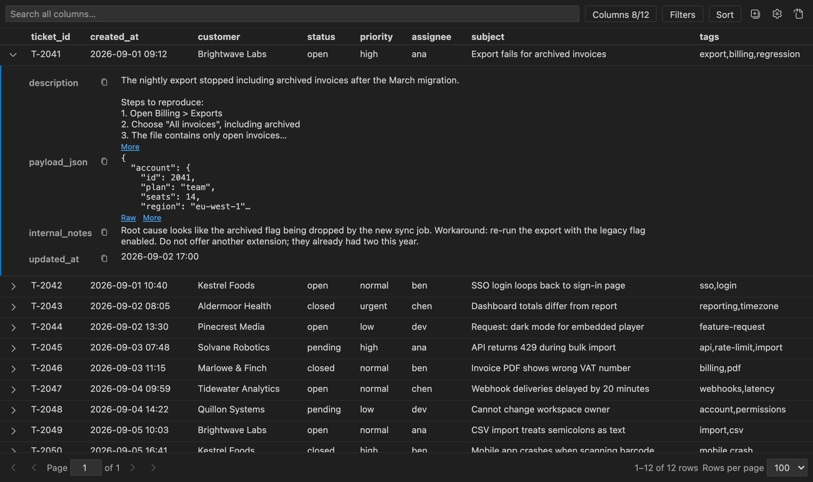

# CSV Viewer: Table + Row Details

Read wide CSV and TSV files in VS Code, Cursor, and Windsurf without scrolling sideways.
The columns you scan stay in the table; expand any row to read everything else — long
notes, descriptions, JSON — in full.

## Open a file

- Right-click a `.csv`, `.tsv` or `.tab` file and choose **Open in CSV Viewer**, or
- click the table icon in the editor title bar while the file is open as text.

The first time you open one of these files as text, CSV Viewer asks once whether to
view it as a table. Choose **Always for CSV Files** to make the viewer the default (you
can also do this yourself through **Open With… → Configure default editor**). The
viewer is read-only; **Open as Text** in its toolbar or the editor title bar takes you
back to the text editor to make edits.

## What it does

- **Table + row details.** Short columns go in the table; long text, multi-line and
  JSON columns start in each row's details. Change the split any time with **Columns**.
- **Reads long values properly.** Row details wrap prose, pretty-print JSON, clamp long
  values with **More**, and have a copy button per field. Columns that hold Markdown
  (headings, lists, tables, code, links) are shown rendered.
- **Find rows fast.** Search all columns, or add filter rules ("Keep rows where status
  equals open"). Click the funnel in a column header to pick several values from that
  column at once, like a spreadsheet. Right-click any value to filter by it or copy it.
- **Sort** by clicking a header; Shift+click adds a second key.
- **Handles messy exports.** Detects comma, semicolon, tab or pipe; warns and offers a
  one-click fix when quotes are malformed; reloads when the file changes on disk.
- **Read-only and private.** Never modifies your file, no telemetry, no network, works
  in untrusted and virtual workspaces.

## Reading wide files

When a file is first opened, CSV Viewer looks at the first 200 rows and puts up to 8
short columns in the table, in file order. Columns that hold long text, line breaks or
JSON start in the row details instead. The toolbar shows the split (**Columns 8/12**),
and the choice you make there is remembered per file.

Click a row's arrow (or the row) to expand it. The details show the columns that
aren't in the table, followed by any table column whose value was cut off. In the
details:

- JSON objects and arrays are formatted, with a **Raw** / **Formatted** switch.
- Markdown is rendered when a column looks like it (headings, fenced code, links,
  tables, or a mix of lists, bold, quotes and inline code in at least 1 in 10 sampled
  values). Click **Raw** to see the source; click **Markdown** on any long, multi-line
  or Markdown-looking value in another column to render it. The choice applies to the
  whole column and is remembered per file. Raw HTML in a cell is shown as text, images
  are never loaded (they appear as a link), and only `http`, `https` and `mailto` links
  are clickable. Table cells always show the raw text.
- Long values show six lines with **More** / **Less**; very large values (over 10,000
  characters) add **Show all**.
- Each field has a copy button, and empty fields show a dash.

Right-click a cell or field for **Copy Value**, **Copy Row as CSV** and **Copy Row as
JSON**.

## Filtering and sorting

The search box matches across every column, including ones in the row details.
**Filters** adds rules that read as sentences: *Keep* or *Hide* rows where a column (or
any column) contains, equals, starts with, ends with or matches a regex, is empty, or
compares as a number (`>`, `<`, `>=`, `<=`). Rows must match all rules. A rule that
can't apply — its column is gone, or it has no value yet — is skipped with a note
rather than hiding everything, and a regex that takes more than 2 seconds is skipped
instead of freezing the view. The button shows how many rules are active
(**Filters • 2**).

To keep or hide several exact values of one column, click the funnel next to its name
in the header (or right-click a cell and choose **Filter ‹column› by Values…**). A list
shows each distinct value with how many rows have it, with a search box and **Select
all** / **Clear** for the values you've searched to; nothing changes until you press
**OK**. The funnel turns blue while that column is filtered. The result is an *is any
of* rule in **Filters**, where you can switch it to **Hide** or edit its values. The
list always counts the whole file, not just the rows currently showing.

Click a column header to sort ascending, then descending, then not at all; Shift+click
adds another key. **Sort** lists every sort key, lets you flip or remove each one, and
can sort by columns that are in the row details. Numbers sort as numbers, text sorts
alphabetically, and empty cells always go last.

## File format

The gear button opens **File format**:

- **Separator**: Auto (shows what was detected), Comma, Semicolon, Tab, Pipe, or a
  custom separator of up to 5 characters.
- **First row is header**: turn off for files without a header row.
- **Quoted fields**: on by default. If a stray `"` makes rows run together, a banner
  offers **Read Quotes as Plain Text**, which turns this off.

These choices are remembered per file. `.tsv` and `.tab` files default to Tab.

## Keyboard

- **Tab** moves through the toolbar, the column headers and into the table.
- In the table: **↑ / ↓** move between rows, **→ / ←** (or **Enter**) expand and
  collapse, **Home / End** jump to the first and last row, **Shift+F10** opens the row
  menu.
- **Cmd/Ctrl+F** focuses the search box. **Alt+← / Alt+→** change page. **Esc** closes
  popovers and menus.

Column headers, sort state, expanded rows and row counts are exposed to screen readers.

## Limits

- Read-only: the viewer never modifies the file.
- It shows what is saved on disk. An unsaved edit in a text editor appears after you
  save.
- Files over 50 MB show a "may be slow" warning; files over 512 MB are not opened.
- Numbers written with a decimal comma (`12,50`) or a thousands separator (`1,000`)
  are treated as text when sorting and filtering.

## Privacy

No telemetry and no network requests. Files are read through the editor's own file
API; nothing is written and no processes are started.

## Settings

| Setting | Default | Description |
| --- | --- | --- |
| `csvViewer.defaultTableColumns` | `8` | The most columns shown in the table when a file is first opened. Long-text and JSON columns start in the row details regardless. |
| `csvViewer.suggestOnOpen` | `true` | Ask once whether to view a CSV/TSV/TAB file as a table when it is first opened as text. |

## Works well with

- [Rainbow CSV](https://marketplace.visualstudio.com/items?itemName=mechatroner.rainbow-csv) colors the columns of a CSV in the text editor.
- [Edit CSV](https://marketplace.visualstudio.com/items?itemName=janisdd.vscode-edit-csv) opens an editable grid.

CSV Viewer is for reading; use it alongside either of those for editing.

## Feedback

See the [changelog](CHANGELOG.md) for release notes, and
[open an issue](https://github.com/ronicayu/csv-viewer/issues) for bugs or requests.
To build or test the extension yourself, see [CONTRIBUTING.md](CONTRIBUTING.md).

## Credits and license

MIT licensed. Parsing by [Papa Parse](https://www.papaparse.com/) (MIT). Icons from
[Codicons](https://github.com/microsoft/vscode-codicons) by Microsoft (CC BY 4.0).
